# vLLM 推理功率控制实验平台

本仓库是一个面向 **vLLM 大语言模型推理能耗控制** 的实验平台。项目围绕 GPU power cap、TTFT、TBT、E2E latency 和能耗之间的关系展开，完成了从静态功率扫描、prefill/decode 分阶段建模，到纯前馈控制、前馈 + PID guard 控制，以及跨模型迁移验证的完整实验链路。

当前最终结果统一整理在 [`./final_result`](./final_result/) 中，README 中展示的图也全部来自该目录。

## 核心结论

| 实验 | 推荐策略 / 结果 | 关键结论 |
|---|---:|---|
| 静态功率封顶 | 200W 可节能约 9.78%-11.33%，E2E 增加约 3.24%-3.61% | 固定降功率有节能空间，但不能适配 prefill/decode 阶段差异 |
| Prefill 策略 | `200/220/260W`，GEOMEAN 节能 8.75%，TTFT 增加 2.70% | 分段功率桶比直接 token-fit 更适合作为 prefill 前馈策略 |
| Decode 策略 | `scheme3_kv_guided`，GEOMEAN 节能 9.62%，TBT 增加 3.18% | 190/205/210W decode 桶在节能和延迟之间最均衡 |
| 纯前馈 out100/out200 | GEOMEAN 节能 10.64% / 11.89% | 仅靠前馈功率桶即可稳定降低能耗 |
| 前馈 + PID out100/out200 | GEOMEAN 节能 10.34% / 11.43% | PID guard 牺牲少量节能，进一步约束 TBT/E2E 代价 |
| Llama 8B 迁移 | GEOMEAN 节能 13.29%，TBT/E2E 增加约 5% | 方法可迁移到相近规模 AWQ 模型 |

## 系统架构

```text
ShareGPT prompts
  -> load_generator.py 生成不同 query count / input token 的请求
  -> llm_inference.py 调用 vLLM OpenAI API 并记录 TTFT/TBT/E2E
  -> run_*_evaluation.py 执行策略、切换 GPU power cap
  -> power_control.py 通过 nvidia-smi -pl 下发真实功率上限
  -> monitor.py 采样 GPU 功率并计算能耗
  -> analyze_*.py / plot_*.py 聚合 CSV、生成报告和论文图
```

主要代码模块：

| 文件 | 作用 |
|---|---|
| [`start_vllm_server.sh`](./start_vllm_server.sh) | 启动 vLLM OpenAI 兼容 API 服务 |
| [`power_control.py`](./power_control.py) | 读取和设置 GPU power cap，封装 sudo 保活 |
| [`monitor.py`](./monitor.py) | 采样 GPU 功率、显存、温度和频率 |
| [`llm_inference.py`](./llm_inference.py) | 封装 vLLM/OpenAI API 调用，记录 TTFT、TBT、E2E |
| [`load_generator.py`](./load_generator.py) | 从 ShareGPT 生成可控 token 长度的负载 |
| [`run_prefill_concurrent_evaluation.py`](./run_prefill_concurrent_evaluation.py) | Prefill 阶段策略评估 |
| [`run_decode_strategy_evaluation.py`](./run_decode_strategy_evaluation.py) | Decode 阶段策略评估 |
| [`run_feedforward_evaluation.py`](./run_feedforward_evaluation.py) | 纯前馈和前馈 + PID 主实验 |
| [`plot_*_image_bar.py`](./plot_decode_strategy_retry_image_bar.py) | 最终论文风格图片绘制 |

## 环境要求

- Python 3.12
- vLLM 0.17.0
- NVIDIA GPU，实验平台为单卡 16GB GPU
- `nvidia-smi` 可用，且当前用户具备设置 power cap 的权限
- 主实验模型目录：`./Qwen2.5-7B-Instruct-AWQ`
- 跨模型迁移实验模型目录：`./Meta-Llama-3.1-8B-Instruct-AWQ-INT4`
- ShareGPT 数据目录：`./input/ShareGPT`

安装依赖：

```bash
pip install -r requirements.txt
```

检查环境：

```bash
python test_env.py
python run_experiment.py --power 240 --show-power-info
```

## 启动 vLLM 服务

主实验使用 `./Qwen2.5-7B-Instruct-AWQ`。当前 `start_vllm_server.sh` 是为了迁移实验切到 Llama 8B AWQ-INT4 的启动示例；如果复现非迁移实验，请将脚本中的 `MODEL_PATH`、`MODEL_NAME` 改回 Qwen。

```bash
bash start_vllm_server.sh
```

关键服务参数：

| 参数 | 当前值 |
|---|---|
| 主实验模型路径 | `./Qwen2.5-7B-Instruct-AWQ` |
| 迁移实验模型路径 | `./Meta-Llama-3.1-8B-Instruct-AWQ-INT4` |
| 量化方式 | AWQ |
| API 地址 | `http://localhost:8000/v1` |
| `max_model_len` | 32768 |
| `max_num_batched_tokens` | 2048 |
| `max_num_seqs` | 64 |
| Prefix caching | disabled |

服务检查：

```bash
curl -sS http://localhost:8000/v1/models
```

## 完整实验流程

### 1. 预填充阶段 Token-Power 建模实验

目标：固定 GPU 高功率上限，改变输入 token 长度，建模 prefill 阶段的功率、TTFT 和能耗关系。

模型：`./Qwen2.5-7B-Instruct-AWQ`

结果目录：

```text
./final_result/01_prefill_token_power_modeling/
```

关键结果：

- 全范围覆盖 45 个 token 长度聚合点。
- 前段 0-3000 tokens 用于更细粒度拟合。
- GPU 活跃功率、TTFT、能耗均随输入 token 长度上升。

示例图：

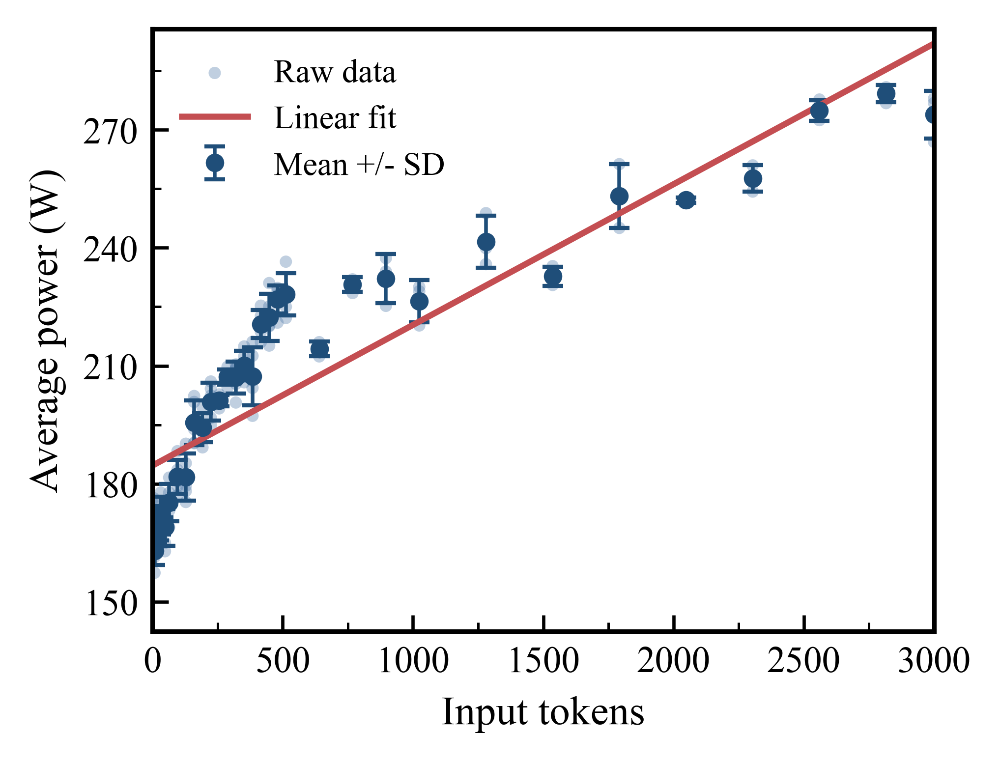

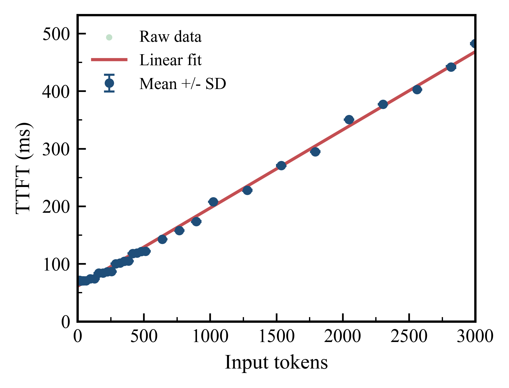

### 2. 预填充阶段策略评估

目标：比较 `Token fit` 与人工分段功率桶，选择满足 TTFT 约束的 prefill 前馈策略。

模型：`./Qwen2.5-7B-Instruct-AWQ`

结果目录：

```text
./final_result/02_prefill_strategy_evaluation/
```

最终图目录：

```text
./final_result/02_prefill_strategy_evaluation/final_paper_figures/
```

主要结果：

| 策略 | GEOMEAN Energy Saving | GEOMEAN TTFT Increase |
|---|---:|---:|
| `200/220/260W` | 8.75% | 2.70% |
| `Token fit` | 3.85% | 0.96% |

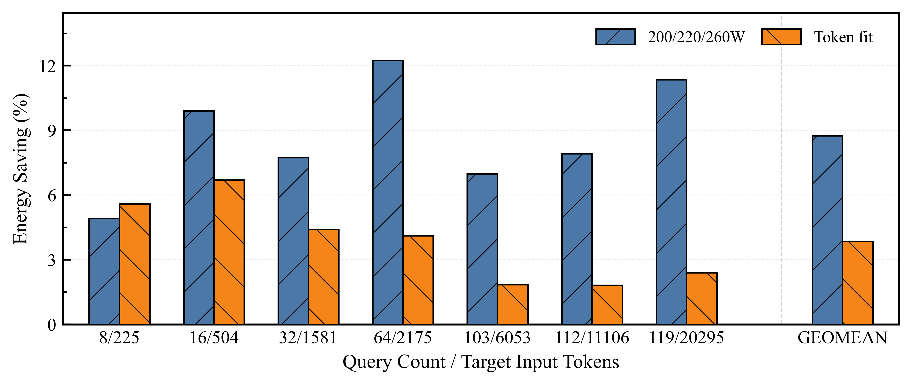

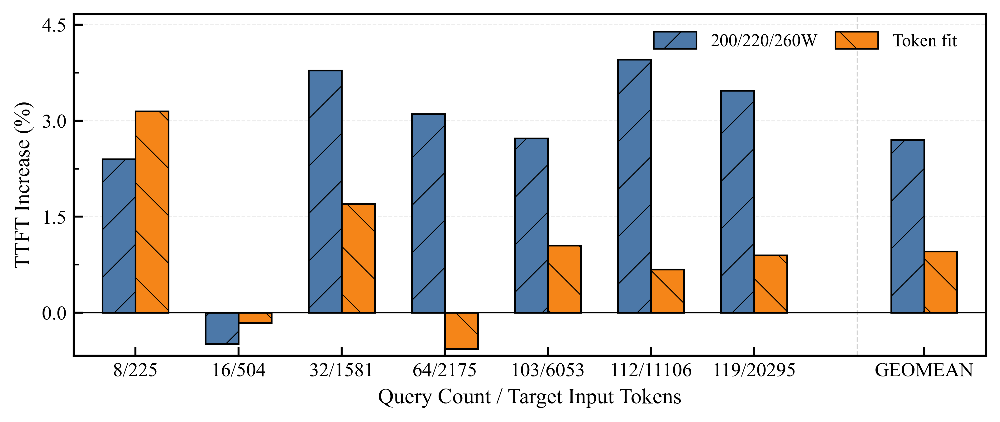

### 3. 解码阶段建模

目标：建模 decode 阶段 power、TBT 与 batch size、output length、KV pressure 的关系。

模型：`./Qwen2.5-7B-Instruct-AWQ`

结果目录：

```text
./final_result/03_decode_modeling/
```

主要结果：

- 覆盖 15 个 batch size、9 个输出长度，共 135 个聚合配置。
- 输出长度从 10 tokens 到 300 tokens 时，平均功率从约 113.79W 升至约 227.71W。
- 常规输出下 TBT 基本稳定在约 68ms 附近。
- `decode_power_by_kv` 分段拟合全局 R2 约 0.9899，MAE 约 3.08W。

示例图：

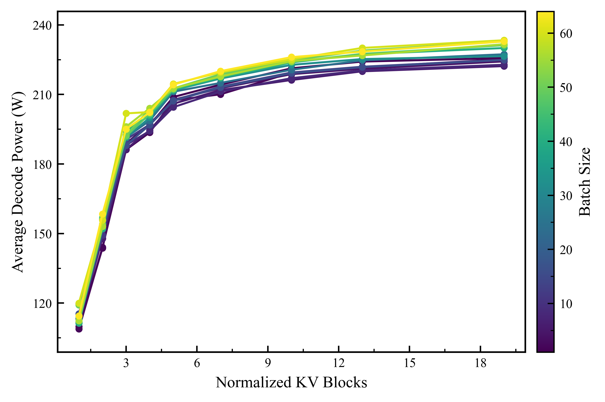

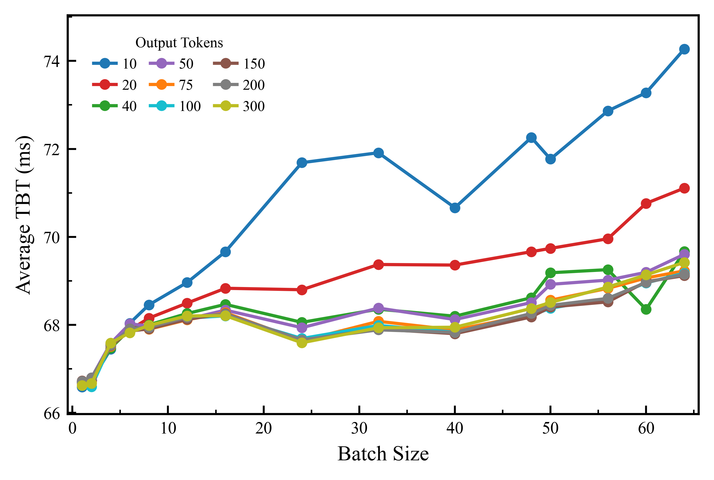

### 4. 解码阶段策略评估

目标：比较多种 decode 功率映射，选择在 TBT 约束下更均衡的策略。

模型：`./Qwen2.5-7B-Instruct-AWQ`

结果目录：

```text
./final_result/04_decode_strategy_evaluation/
```

最终图目录：

```text
./final_result/04_decode_strategy_evaluation/final_paper_figures/
```

主要结果：

| 策略 | GEOMEAN Energy Saving | GEOMEAN TBT Increase | 平均功率 |
|---|---:|---:|---:|
| `scheme1_fit_curve` | 12.04% | 5.64% | 184.95W |
| `scheme2_fit_plus` | 9.05% | 4.01% | 193.39W |
| `scheme3_kv_guided` | 9.62% | 3.18% | 190.70W |

最终推荐 `scheme3_kv_guided`，即 decode guarded 桶：

```text
q = 8, 16, 32 -> 190W
q = 64, 96    -> 205W
q = 128       -> 210W
```

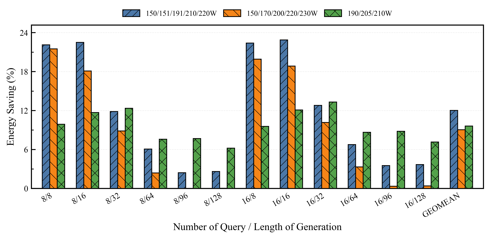

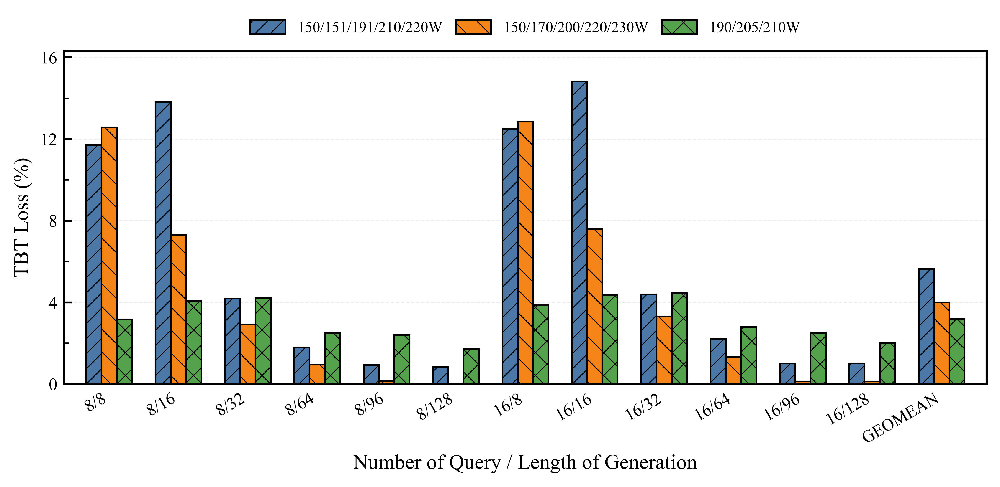

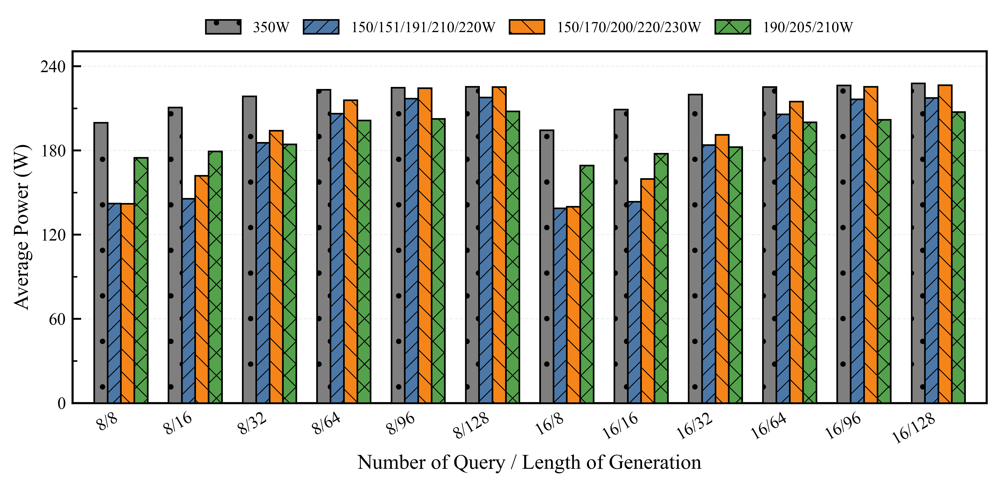

### 5. 纯前馈控制器实验

目标：在完整请求中使用 prefill/decode 前馈功率规则，与 `baseline_350w` 对比。

模型：`./Qwen2.5-7B-Instruct-AWQ`

结果目录：

```text
./final_result/05_pure_feedforward_controller/
```

最终图目录：

```text
./final_result/05_pure_feedforward_controller/final_paper_figures/
```

GEOMEAN 结果：

| Output length | Energy Saving | TBT Increase | TTFT Increase | E2E Increase |
|---:|---:|---:|---:|---:|
| 100 | 10.64% | 4.11% | 4.43% | 4.30% |
| 200 | 11.89% | 4.05% | 4.11% | 4.17% |

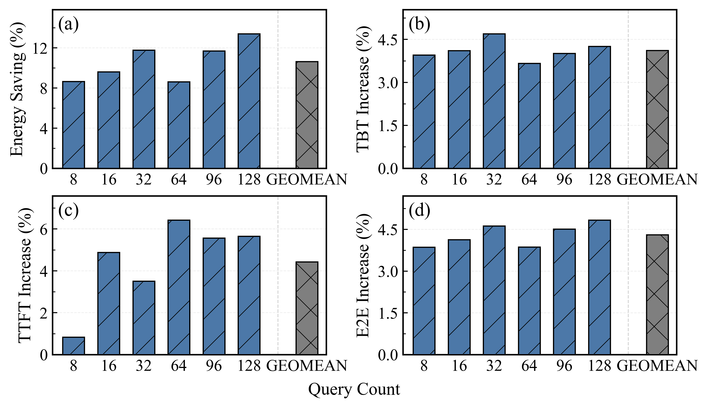

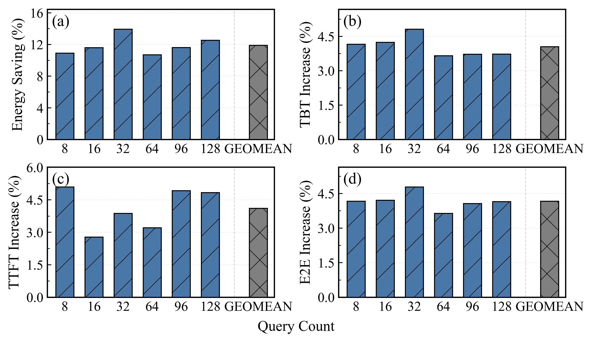

### 6. 前馈 + PID 策略评估

目标：在前馈基础功率上叠加 PID guard。PID 只做正向补偿，用于在 TTFT/TBT 超预算时提高功率，降低延迟失控风险。

模型：`./Qwen2.5-7B-Instruct-AWQ`

结果目录：

```text
./final_result/06_feedforward_pid_evaluation/
```

最终图目录：

```text
./final_result/06_feedforward_pid_evaluation/final_paper_figures/
```

GEOMEAN 结果：

| 策略 | Output length | Energy Saving | TBT Increase | TTFT Increase | E2E Increase |
|---|---:|---:|---:|---:|---:|
| 纯前馈 | 100 | 10.64% | 4.11% | 4.43% | 4.30% |
| 前馈 + PID | 100 | 10.34% | 4.02% | 3.94% | 4.11% |
| 纯前馈 | 200 | 11.89% | 4.05% | 4.11% | 4.17% |
| 前馈 + PID | 200 | 11.43% | 3.94% | 4.51% | 4.04% |

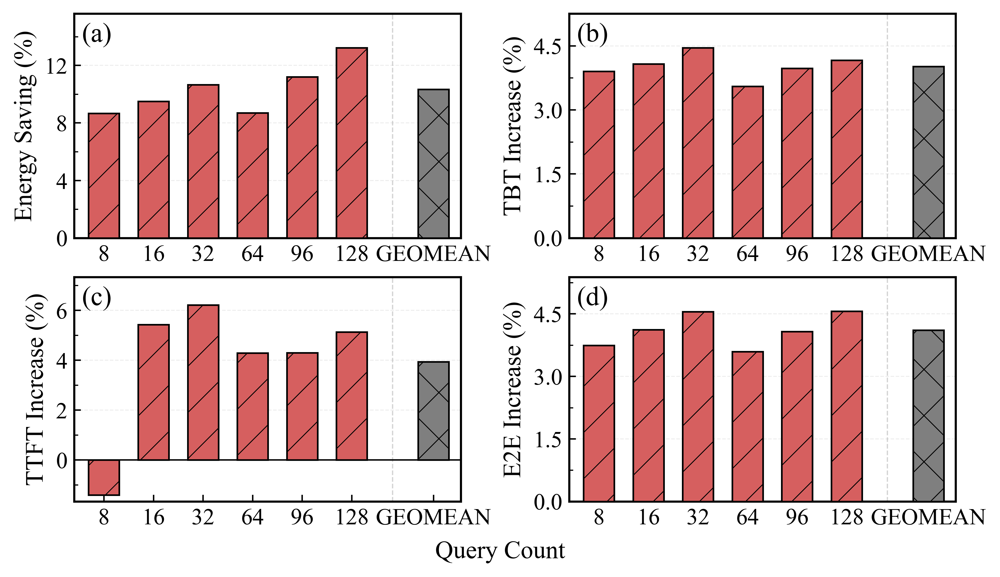

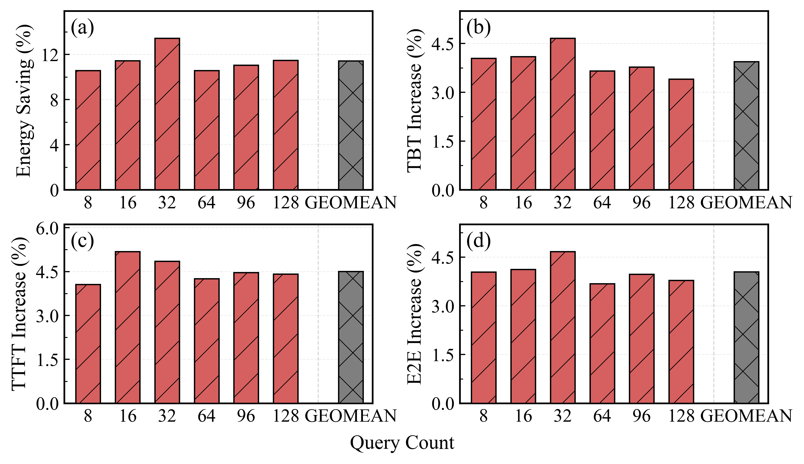

### 7. 迁移到 Llama 模型的实验结果

目标：将前馈 + PID 控制迁移到相近规模的新模型 `Meta-Llama-3.1-8B-Instruct-AWQ-INT4`。

模型：`./Meta-Llama-3.1-8B-Instruct-AWQ-INT4`

结果目录：

```text
./final_result/07_llama_migration/
```

最终图目录：

```text
./final_result/07_llama_migration/final_paper_figures/
```

GEOMEAN 结果：

| 指标 | 结果 |
|---|---:|
| Energy Saving | 13.29% |
| TBT Increase | 5.34% |
| TTFT Increase | 5.19% |
| E2E Increase | 5.39% |

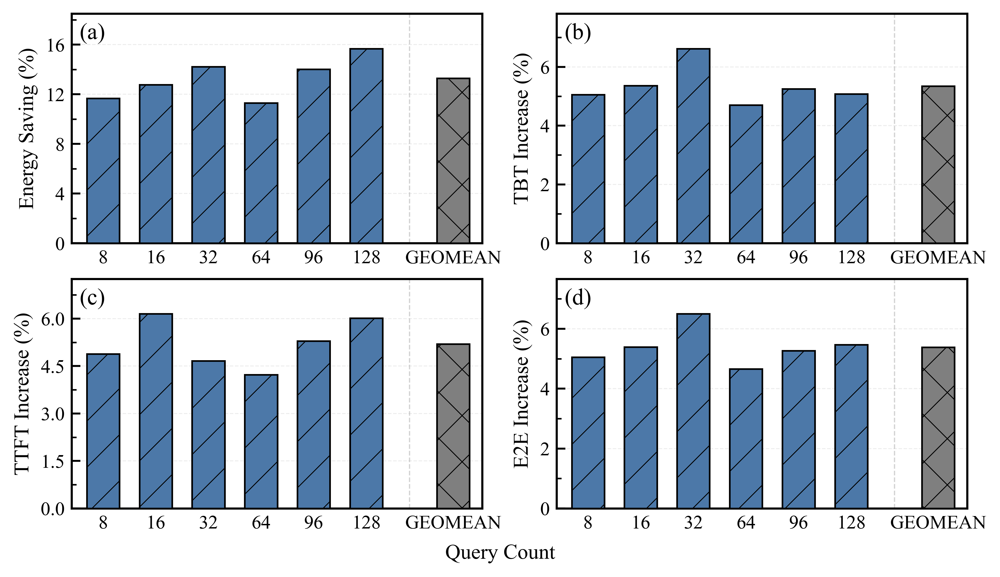

## 复现实验命令

### Prefill 策略评估

```bash
bash run_prefill_concurrent_evaluation.sh
```

### Decode 策略评估

```bash
bash run_decode_strategy_evaluation.sh
```

### 纯前馈 / 前馈 + PID 完整实验

```bash
bash run_feedforward_evaluation.sh
```

单独 smoke 示例：

```bash
python run_feedforward_evaluation.py \
  --output-dir experiment_results/feedforward/smoke_llama_pid \
  --model-path ./Meta-Llama-3.1-8B-Instruct-AWQ-INT4 \
  --tokenizer-path ./Meta-Llama-3.1-8B-Instruct-AWQ-INT4 \
  --served-model-name Meta-Llama-3.1-8B-Instruct-AWQ-INT4 \
  --sharegpt-dir ./input/ShareGPT \
  --base-url http://localhost:8000/v1 \
  --output-lengths 100 \
  --repeats-per-batch 1 \
  --full-repeats 1 \
  --warmup-batches 0 \
  --monitor-warmup-batches 0 \
  --pid-targets-path feedforward_pid_targets.json \
  --decode-recommendation-json experiment_results/decode_power_cap_batch_sweep/multi_load_tbt5_out100/images/decode_bucket_recommendations_q64_q96_205w_q128_210w_override.json \
  --only-strategy ff_decode_tbt_guarded_pid
```

正式实验不要加 `--skip-set-power`，否则不会真实修改 GPU power cap。

非迁移实验复现时请使用 Qwen 模型参数，例如：

```bash
--model-path ./Qwen2.5-7B-Instruct-AWQ \
--tokenizer-path ./Qwen2.5-7B-Instruct-AWQ \
--served-model-name Qwen2.5-7B-Instruct-AWQ
```

## 重新生成最终图片

```bash
python plot_prefill_energy_ttft_two_strategies_image_bar.py
python plot_decode_strategy_retry_image_bar.py
python plot_separate_strategy_metrics_2x2.py
python plot_llama_pid_guard_metrics_2x2.py
```

这些脚本生成带 hatch、600 dpi 的论文风格图，并输出 PNG/PDF/SVG。

## 最终结果目录

[`./final_result`](./final_result/) 是结题检查用的最终结果包，按实验分开：

| 目录 | 内容 |
|---|---|
| [`00_overview`](./final_result/00_overview/) | 代码和实验参数总览 |
| [`01_prefill_token_power_modeling`](./final_result/01_prefill_token_power_modeling/) | Prefill token-power 建模 |
| [`02_prefill_strategy_evaluation`](./final_result/02_prefill_strategy_evaluation/) | Prefill 策略评估 |
| [`03_decode_modeling`](./final_result/03_decode_modeling/) | Decode 建模 |
| [`04_decode_strategy_evaluation`](./final_result/04_decode_strategy_evaluation/) | Decode 策略评估 |
| [`05_pure_feedforward_controller`](./final_result/05_pure_feedforward_controller/) | 纯前馈实验 |
| [`06_feedforward_pid_evaluation`](./final_result/06_feedforward_pid_evaluation/) | 前馈 + PID 实验 |
| [`07_llama_migration`](./final_result/07_llama_migration/) | Llama 迁移实验 |

每个实验目录中包含：

- 对应 Markdown 总结
- `*_raw.csv`
- `*_aggregated.csv`
- `*_metadata.json`
- 分析报告和图片
- `final_paper_figures/` 中的最终版图

## 文档索引

| 文档 | 说明 |
|---|---|
| [`final_result/00_overview/代码内容整理.md`](./final_result/00_overview/代码内容整理.md) | 代码和结果概述 |
| [`final_result/00_overview/实验参数表格.md`](./final_result/00_overview/实验参数表格.md) | 实验平台和参数总表 |
| [`final_result/01_prefill_token_power_modeling/预填充阶段 Token-Power 建模实验总结.md`](./final_result/01_prefill_token_power_modeling/预填充阶段%20Token-Power%20建模实验总结.md) | Prefill 建模总结 |
| [`final_result/02_prefill_strategy_evaluation/预填充阶段策略评估.md`](./final_result/02_prefill_strategy_evaluation/预填充阶段策略评估.md) | Prefill 策略总结 |
| [`final_result/03_decode_modeling/解码阶段建模.md`](./final_result/03_decode_modeling/解码阶段建模.md) | Decode 建模总结 |
| [`final_result/04_decode_strategy_evaluation/解码阶段策略评估.md`](./final_result/04_decode_strategy_evaluation/解码阶段策略评估.md) | Decode 策略总结 |
| [`final_result/05_pure_feedforward_controller/纯前馈控制器.md`](./final_result/05_pure_feedforward_controller/纯前馈控制器.md) | 纯前馈实验总结 |
| [`final_result/06_feedforward_pid_evaluation/前馈+pid策略评估.md`](./final_result/06_feedforward_pid_evaluation/前馈+pid策略评估.md) | 前馈 + PID 总结 |
| [`final_result/07_llama_migration/模型llama.md`](./final_result/07_llama_migration/模型llama.md) | Llama 迁移实验总结 |

## 注意事项

- 运行真实功率控制实验前，请确认 `nvidia-smi -pl` 权限可用。
- `--skip-set-power` 只适合 smoke 或连通性测试，不适合正式能耗实验。
- 非迁移实验默认模型为 `./Qwen2.5-7B-Instruct-AWQ`；只有第 7 部分跨模型迁移实验使用 `./Meta-Llama-3.1-8B-Instruct-AWQ-INT4`。
- Llama 3.1 默认最大上下文为 131072，单卡 16GB 显存下需要像 `start_vllm_server.sh` 一样设置 `--max-model-len 32768`。
- 实验结果中的相对指标均以同一实验目录下的 `baseline_350w` 为基准，不跨目录混用 baseline。
- `final_result` 是从正式实验目录 copy 得到的结果包，原始实验目录仍保留在 `experiment_results/` 下。
