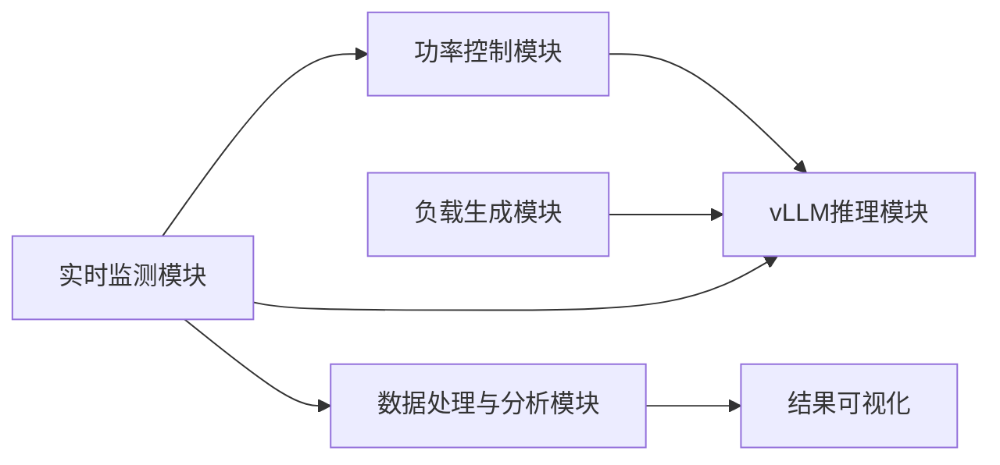
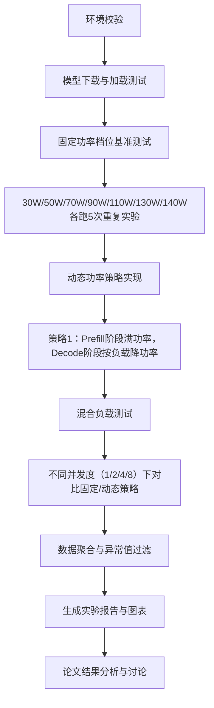

# 《基于动态功率调节的大语言模型推理能耗控制》实验设计文档

## 1. 实验概述
- **实验目标**：研究不同功率调节策略对大语言模型推理性能与能耗的影响，验证动态功率调节方案的优化效果
- **实验环境**：本地RTX 5070Ti Laptop（12GB显存），vLLM 0.17.0，Python 3.12
- **实验模型**：Qwen2-7B-Instruct-GPTQ-4bit（主实验）、Llama-3-8B-Instruct-GPTQ-4bit（基准对比）

## 2. 总体架构

## 3. 核心模块设计
### 3.1 功率控制模块
- 实现：`nvidia-smi` 命令行封装，需要sudo权限
- 功能：支持动态设置GPU功率限制，范围30W~140W
- 接口：`set_power_cap(watts: int) -> bool`

### 3.2 推理模块
- 实现：vLLM Python API，加载4bit量化模型
- 功能：支持同步/异步推理调用，KV缓存自动管理
- 配置：max_model_len=8192, gpu_memory_utilization=0.9

### 3.3 负载生成模块
- 实现：自定义请求生成器 + ShareGPT公开数据集
- 功能：支持混合长度请求，单请求/批量并发模式
- 负载类型：
  - 短输入短输出（<256 tokens）
  - 长输入短输出（2048~4096 tokens输入，<256输出）
  - 短输入长输出（<256输入，1024~2048输出）

### 3.4 监测模块
- 实现：`pynvml` 库 + 时间戳打点
- 采样频率：100ms
- 监测指标：
  - 性能指标：TTFT（首字延迟）、TBT（Token间延迟）、E2E（端到端延迟）
  - 功耗指标：GPU实时功率、显存使用率、温度
  - 计算指标：总能耗、能耗延迟乘积（EDP）

### 3.5 数据分析与可视化模块
- 实现：`pandas` + `numpy` + `matplotlib` + `seaborn`
- 输出：
  - 功率-延迟对比曲线
  - 功率-能耗对比曲线
  - EDP（能耗延迟乘积）对比柱状图
  - 实验结果统计表格

## 4. 实验流程设计

## 5. 指标计算标准
1. **TTFT（Time To First Token）**：从请求发出到第一个token生成的时间，单位ms
2. **TBT（Time Between Tokens）**：相邻两个token生成的平均时间，单位ms
3. **E2E（End to End）**：从请求发出到所有token生成完成的总时间，单位ms
4. **总能耗**：功率采样值 × 采样间隔的积分值，单位焦耳（J）
5. **EDP（Energy-Delay Product）**：平均E2E延迟 × 总能耗，综合评价指标，越小越好

## 6. 实验控制变量
- 固定变量：模型参数、推理配置、输入输出长度
- 控制变量：功率限制值、并发度、功率调节策略
- 重复次数：每个实验组合重复5次，取平均值并计算标准差

## 7. 预期成果
1. 固定功率下的性能-能耗基准曲线
2. 动态功率调节策略相对固定策略的优化效果（预期EDP降低15%~25%）
3. 不同负载场景下的最优功率配置建议
